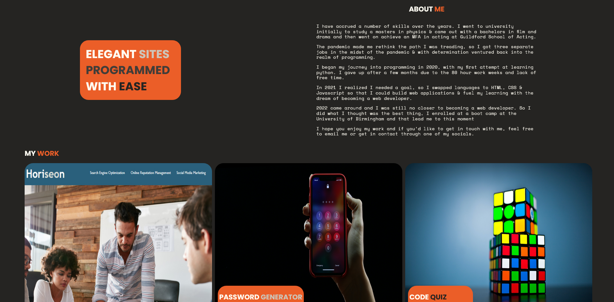

# George Fincher Web Portfolio

## Description

A portfolio of all the work and projects I've completed. Email [finchergeorge1@gmail.com](mailto:finchergeorge1@gmail.com) if you're interested in hiring or looking to work with me.

The portfolio itself shows the skills I've accrued using all the various technologies I've learned over the short time I've been coding diligently.

### User Story

AS AN employer
I WANT to view a potential employee's deployed portfolio of work samples
SO THAT I can review samples of their work and assess whether they're a good candidate for an open position

### What did I Learn

- I'm fairly familiar with most of these technologies but I've learned more about using media queries effectively.
- I've also learned more about how to use grid.
- I've learned how to use inline SVGs and how to style them effectively.
- I've learned more about using figma to help wire-frame and design the sites I make.

## Table of Contents

1. [Description](#description)
2. [Screenshot](#screenshot)
3. [Usage](#usage)
4. [Technology](#technology)
5. [Features](#features)
6. [Badges](#badges)
7. [Credits](#credits)
8. [Feedback](#feedback)

## Screenshot

## Usage

If you would like to view this project please follow [this link]()

## Technology

The technology used for the development of this site was:

- [github pages](https://pages.github.com/)
- HTML
- CSS
- Flexbox
- Grid

## Features

- Featured work section is laid out using grid.
- Navbar is laid out in a pleasing manner and links to the correct sections.
- Links on the featured work, link to the pages that are completed.
- The site is responsive to the size of the screen and is mobile friendly.

## Badges

## Credits

This website was made with the help of the:

- [University of Birmingham Coding Bootcamp](https://www.birmingham.ac.uk/postgraduate/courses/cpd/coding-boot-camp.aspx)

## Feedback

Any feedback please email [George Fincher](mailto:finchergeorge1@gmail.com)
